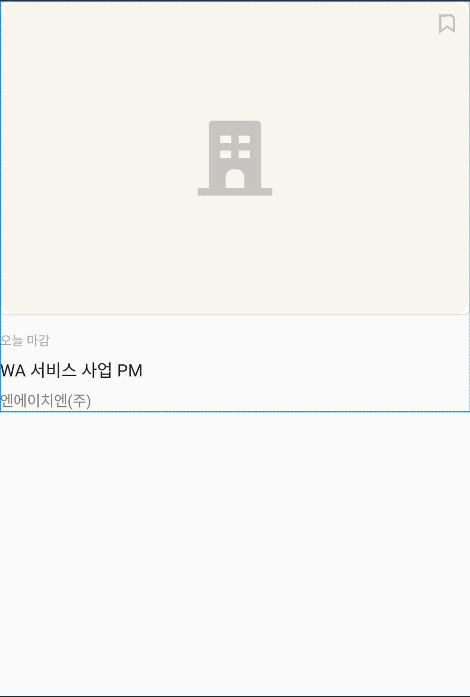

### app:layout_constraintDimensionRatio
ConstraintLayout 내에 있는 View 의 width, height 를 비율에 맞게 정의하려면 `app:layout_constraintDimensionRatio` 속성을 사용하면 된다.
<br>
ex. 가로 : 세로 비율을 3:2 로 정의하는 경우
```xml
<ImageView
    android:id="@+id/img_job_posting"
    android:layout_width="match_parent"
    android:layout_height="0dp"
    android:padding="@dimen/thick_divider_height"
    android:background="@drawable/bg_rect_stroke_divider_dark_background_white_fixed_radius4"
    app:srcCompat="@drawable/image_company_default"
    app:layout_constraintEnd_toEndOf="parent"
    app:layout_constraintStart_toStartOf="parent"
    app:layout_constraintTop_toTopOf="parent"
    app:layout_constraintDimensionRatio="H,3:2"
    />
```



<br>
ex. 리멤버 채용공고 탭
<br>

