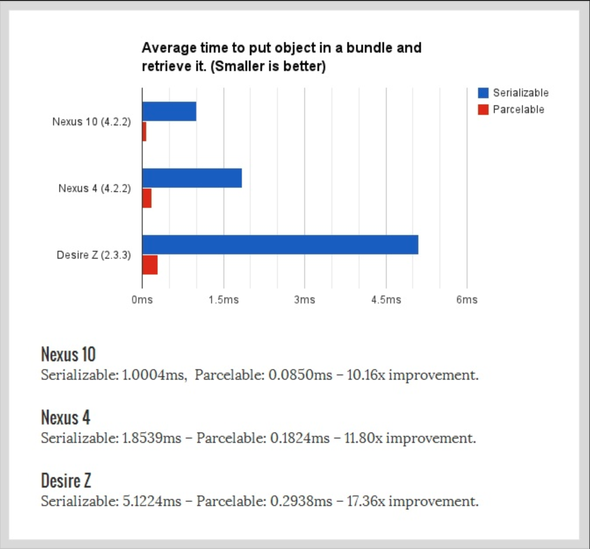

### Serializable

* Java 인터페이스
* 해당 클래스가 직렬화 대상이라고 알려주기만 할뿐 어떠한 메서드도 가지지 않는 단순한 ‘마커 인터페이스 (Marker Interface)’
    * 사용 방법이 쉽다는 것은 곧 시스템적인 비용이 비싸다는 것을 의미한다.
* 내부에서 Reflection 을 사용하여 직렬화를 처리함
    * Reflection
        * 구체적인 클래스 타입을 알지 못해도 그 클래스의 메소드, 타입, 변수들에 접근할 수 있도록 해주는 자바 API
        * 코드를 작성할 시점에는 어떤 타입의 클래스를 사용할지 모르지만, 런타임 시점에 지금 실행되고 있는 클래스를 가져와서 실행해야 하는 경우, 프레임워크나 IDE에서 이런 동적인 바인딩을 이용한 기능을
          제공한다. (intelliJ 의 자동완성 기능, 스프링의 어노테이션이 리플렉션을 이용한 기능)
            * ex. 생성자 찾기
              ```java
              Class clazz = Class.forName("Person");
              Constructor constructor = clazz.getDeclaredConstructor(); // 인자가 없는 생성자
              ```

### Parcelable

* 직렬화를 위한 또 다른 인터페이스
* AndroidSDK 의 인터페이스 (Serializable 과 달리 표준 Java 가 아닌 Android SDK 의 인터페이스)
* 타입을 추론해야하는 Reflection 을 사용하는 대신 직렬화 과정을 명시하여 더 빠르게 직렬화
* IPC(Inter Process Communication)에 최적화된 기능 제공
* Serialization 은 reflection 을 사용하여 serialization 을 하는데, parcelable 은 프로그래머가 직접 바로 setting 해주기에 빠르다. 다만 Serializable 을
  custom 하여 writeObject() 와 readObject() 를 직접 구현해준다면 reflection 방식에서 발생하게 되는 문제들을 줄일 수 있다고 함

|  | Serializable | Parcelable | Serializable (kotlin) |
| --- | --- | --- | --- |
| Name w/Package | java.io.Serializable | android.os.Parcelable | kotlinx.serialization.Serializable |
| 직렬화 처리 | Reflection 사용 | 직렬화 과정을 명시하는 함수를 override 하여 직렬화를 빠르게 처리 | JSON 형식의 문자열 ↔ 모델 |
| 특징 | 마커 인터페이스 (MarkerInterface) | 타입을 추론해야하는 Reflection 을 사용하는 대신 직렬화 과정을 명시하여 더 빠르게 직렬화할 수 있다. (다만 Serializable 을 커스텀하여 writeObject() 와 readObject() 를 직접 구현한다면 reflection 방식에서 발생하는 문제들을 줄일 수 있다.) | Json 형식을 직렬화/역직렬화 하는 방법은 Gson 을 사용하거나 Moshi 를 사용할 수 있으나,  class 내 정의한 default 값을 무시하고 0 혹은 null 로 직렬화한다는 문제점이 있다.
Kotlin Serializable 은 해당 변수에 프로퍼티를 포함하고 있지 않음을 확인하여 null 대신 기본값을 대입한다. |

* Reflection: 구체적인 클래스 타입을 알지 못해도 그 클래스의 메소드/변수 들에 접근할 수 있도록 해주는 자바 API. 코드를 작성할 시점에는 어떤 타입의 클래스를 사용할지 모르지만, 런타임 시점에 지금
  실행되고 있는 클래스를 가져와서 실행해야 하는 경우, 프레임워크나 IDE에서 이런 동적인 바인딩을 이용한 기능을 제공함.



<br>

(
출처: [https://www.developerphil.com/parcelable-vs-serializable/](https://www.developerphil.com/parcelable-vs-serializable/))

### Kotlin Serializable

(
출처: [https://mashup-android.vercel.app/mashup-12th/jieun/kotlinx-serialization/](https://mashup-android.vercel.app/mashup-12th/jieun/kotlinx-serialization/))

Json 형식을 직렬화/역직렬화 하는 방법은 Gson 을 사용하거나 Moshi 를 사용할 수 있다. 다만 Gson 과 Moshi 는 data class 의 default 값을 무시하고 0 혹은 null 로
직렬화한다는 문제점이 있다.

* Kotlin Serializable 은 JetBrains 에서 만든 Kotlin 을 위한 JSON 라이브러리이며, 빠른 JSON 인코딩/디코딩을 지원한다.
* 멀티플랫폼 지원: Gson 과 Moshi는 자바 라이브러리이므로, 자바를 지원하는 플랫폼에서만 사용할 수 있다. 하지만 Kotlinx Serialization 라이브러리는 자바, 자바스크립트, 네이티브 등 다양한
  플랫폼을 지원하므로, 공용 라이브러리에 구현해서 사용할 수 있다.
* 코틀린 지향: 위의 코드에서 Gson 라이브러리로 파싱했을때, default value는 무시하고 0이 되며, Not-Nullable 타입이 null이 되는 문제가 있었다. 하지만 Kotlinx
  Serialization 라이브러리를 사용하면 해당 변수에 프로퍼티를 포함하고 있지 않음을 확인해서 null 대신 기본값을 대입할 수 있다.
* 컴파일 안전 보장: 다른 라이브러리와는 다르게 Kotlinx Serialization 라이브러리는 `@Serializable` 어노테이션이 있는 클래스만 직렬화하기 때문에, 직렬화를 수행할 수 없는 경우 런타임
  에러 대신 컴파일 에러가 발생하므로 버그를 사전에 방지할 수 있다.

[참고링크]

- Parcelable vs
  Serializable: [https://velog.io/@jaeyunn_15/Android-Parcelable-vs-Serializable](https://velog.io/@jaeyunn_15/Android-Parcelable-vs-Serializable)