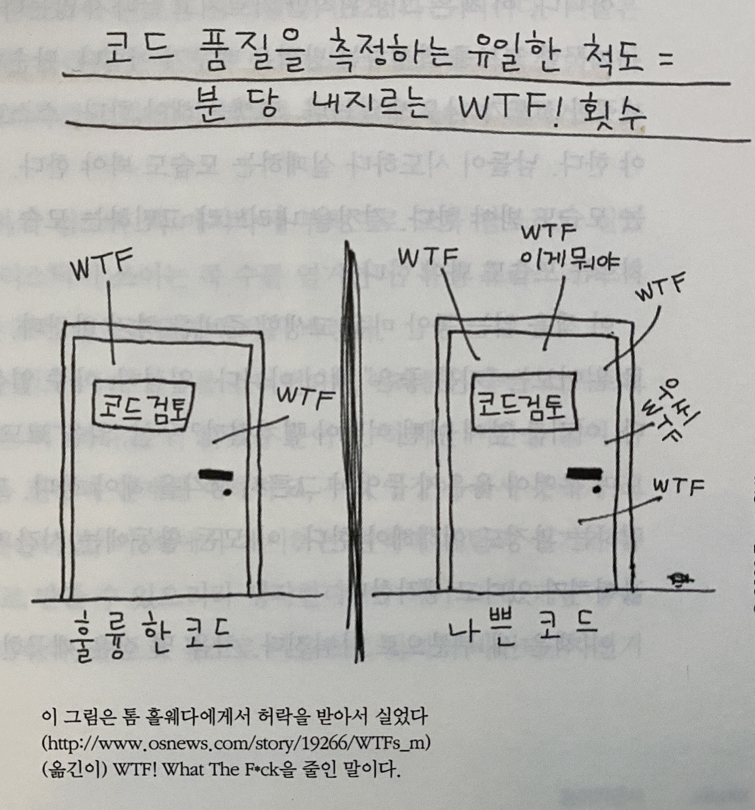

## Table of contents

#### 1장 깨끗한 코드 (Clean Code)

#### 2장 의미 있는 이름 (Meaningful Names)

#### 3장 함수 (Functions)

#### 4장 주석 (Comments)

#### 5장 형식 맞추기 (Formatting)

#### 6장 객체와 자료 구조 (Objects and Data Structures)

#### 7장 오류 처리 (Error Handling)

#### 8장 경계 (Boundaries)

#### 9장 단위 테스트 (Unit Tests)

#### 10장 클래스 (Classes)

#### 11장 시스템 (Systems)

#### 12장 창발성 (Emergence)

#### 13장 동시성 (Concurrency)

#### 14장 점진적인 개선 (Successive Refinement)

#### 15장 JUnit 들여다보기 (JUnit Internals)

#### 16장 SerialDate 리팩터링 (Refactoring SerialDate)

#### 17장 냄새와 휴리스틱 (Smells and Heuristics)

 

#### 0 들어가면서

> 난관에 부딪힐 때 옳은 문 뒤에 있으려면 어덯게 해야 할까? 답은 장인 정신이다.
> 장인 정신을 익히는 과정은 두 단계로 나뉜다. 바로 이론과 실전이다. 첫째, 장인에게 필요한 원칙, 패턴, 기법, 경험이라는 지식을 **습득**해야 한다. 둘째, 열심히 일하고 연습해 지식을 몸과 마음으로 **체득**해야 한다.

> 깨끗한 코드를 작성하는 방법은 배우기 어렵다. 단순히 원칙과 패턴을 안다고 깨끗한 코드가 나오지 않는다. 고생을 해야한다. 

> 이 책은 세 부분으로 나눠진다. 처음 몇 장은 깨끗한 코드를 작성한느 원칙, 패턴, 실기를 설명한다.
> 둘째 부분은 좀 더 어렵다. 여러 사례 연구를 소개하는데, 복잡도는 점점 더 높아진다. 각 사례 연구는 코드를 깨끗하게 고치는, 즉 문제가 있는 코드를 문제가 더 적은 코드로 바꾸는 연습이다.
> 셋째 부분은 결말이다. 사례 연구를 만들면서 수집한 냄새와 휴리스틱(heuristic)을 마지막 장에서 열거한다. 사례 연구에서 코드를 분석하고 정리하면서 우리는 우리 행위의 모든 이유를 휴리스틱이나 냄새로 정의했다.