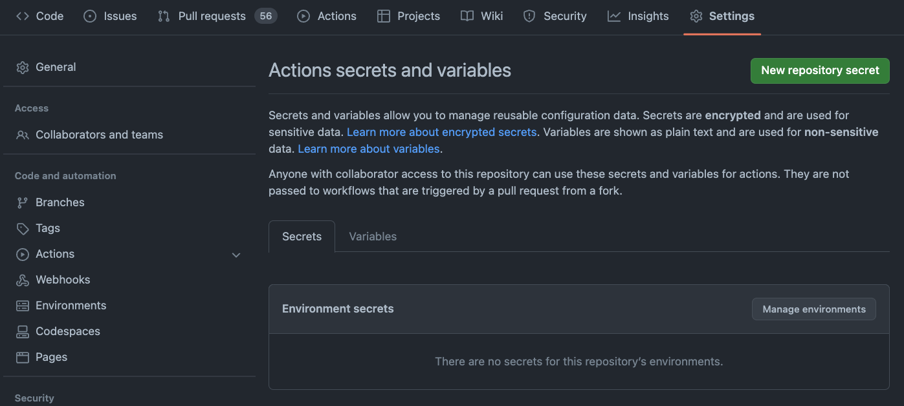
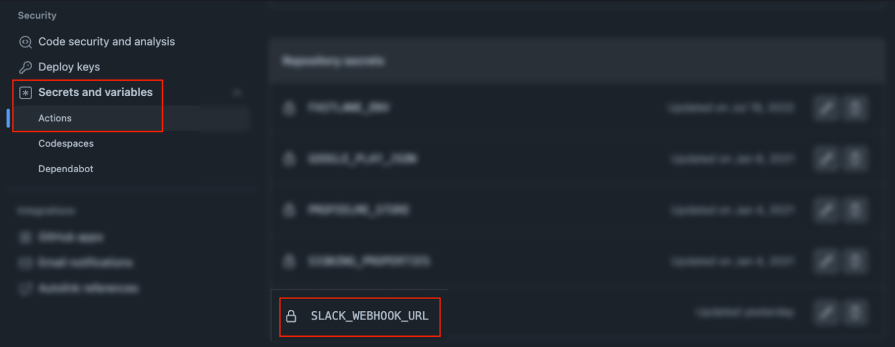
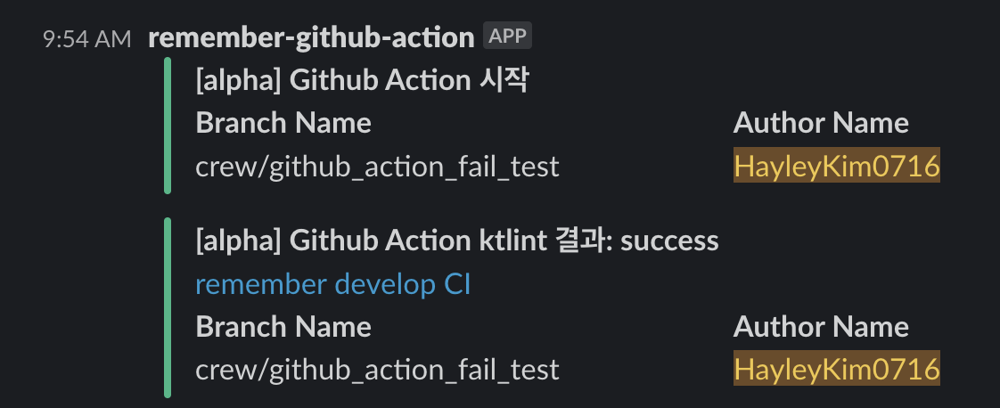

[github marketplace](https://github.com/marketplace) 에서 slack 이라고 검색하면 슬랙과 연동할 수 있는 [action 리스트](https://github.com/marketplace?type=actions&query=slack+)를 확인할 수 있는데, 그 중 star 를 많이 받은 [action-slack](https://github.com/8398a7/action-slack) 을 사용해 보았다.
marketplace 페이지와 document 를 확인하면 따라하는 것은 어렵지 않으며, 테스트 하면서 어떤 속성을 노출할 것인지 결정하면 된다.
필수로 미리 알아야 할 것과 테스트하면서 깨달은 점을 몇 가지 작성해본다.

1. ${{ secrets.SLACK_WEBHOOK_URL }}
    - `${{ }}` 는 github action 에서 사용가능한 변수를 의미하며, `${{ secrets.~ }}` 는 github repository settings 에서 정의한 변수를 의미한다.
      
      
      - [Slack API](https://api.slack.com/apps?new_app=1) 에서 `From scratch` 선택 후 App Name 과 workplace, channel 을 선택 해 앱을 생성하면 'Features' -> 'Incoming Webhooks' 에서 WebhookURL 을 복사해 위 설정에서 secrets 를 추가하면 된다.
2. ${{ github.actor }}, ${{ github.ref_name }}
    - 이 또한 github action 에서 사용 가능한 변수이며, ${{ github.actor }} 는 workflow 를 실행한 github user name 를, ${{ github.ref_name }} 은 workflow 를 실행하도록 trigger 된 브랜치명을 의미한다.
    - [github context 문서](https://action-slack.netlify.app/usage/fields/)
3. ${ process.env.AS_WORKFLOW }
   - `${ }` 는 [action-slack](https://github.com/8398a7/action-slack) 에서 제공하는 변수를 의미하며, custom_payload 에서 사용하려면 fields 에 사용할 변수를 추가해야한다.
   - fields 와 value 는 [Document](https://action-slack.netlify.app/usage/fields/) 에서 확인할 수 있다.
   - 다만 이는 `text` 에서만 사용 가능

### 샘플 코드
```yaml
jobs:
    build:
        runs-on: ubuntu-latest
        env:
            SLACK_WEBHOOK_URL: ${{ secrets.SLACK_WEBHOOK_URL }}
            ...
        
        steps:
        - uses: 8398a7/action-slack@v3
          with:
            status: custom
            fields: workflow
            custom_payload: |
              {
                attachments: [{
                  title: '[alpha] Github Action 시작', 
                  color: '${{ job.status }}' === 'success' ? 'good' : '${{ job.status }}' === 'failure' ? 'danger' : 'warning',
                  fields: [{
                    title: 'Branch Name',
                    value: '${{ github.ref_name }}',
                    short: true
                  },
                  {
                    title: 'Author Name',
                    value: '${{ github.actor }}',
                    short: true
                  }],
                  actions: [{
                  }]
                }]
              }
          if: always()
        - uses: ...
```

결과


### 참고링크
* [action-slack](https://github.com/8398a7/action-slack)
* [action-slack Document](https://action-slack.netlify.app/)
* [github context Document](https://action-slack.netlify.app/usage/fields/)

