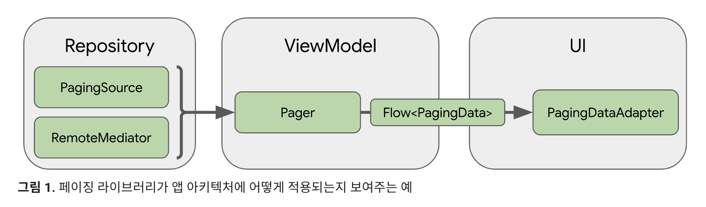
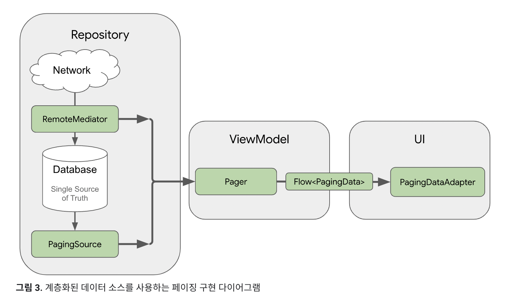
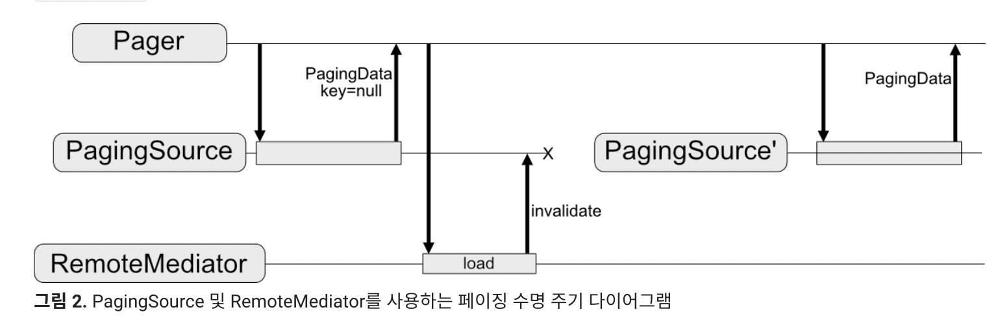
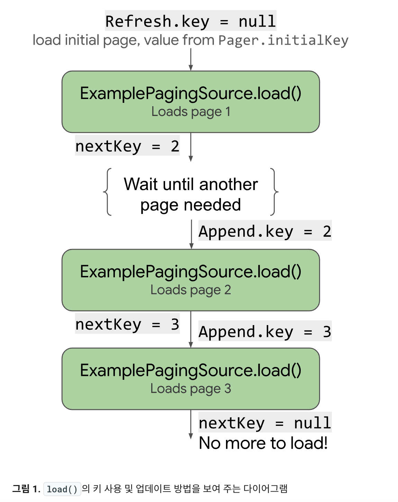

### Paging3
Pagination 을 안드로이드 권장 App Architecture 에 맞게 구현할 수 있도록 도와주는 라이브러리

[장점]
* 불필요한 데이터를 요청하지 않아도 됨
* 페이징된 데이터를 메모리 내 캐싱
* 요청 중복 제거 기능 제공 
* 끝까지 스크롤 했을 때 RecyclerView 의 adapter 가 자동으로 데이터 요청
* 새로고침 및 재시도 기능 제공
* Kotlin Coroutine, Flow, LiveData, RxJava 지원

[Paging2 vs Paging3]
* 구현 방법
  * Paging2: DataSource, PagedList, PagedListAdapter
  * Paging3: PagingSource, PagedListAdapter
* Paging3 에서 Coroutine, Flow, RxJava 지원
* refresh 및 retry 기능 제공. 반응형 UI 디자인을 위해 로드 상태와 오류 신호가 내장됨

[Library Architecture]

Paging3 라이브러리는 권장 App Architecture 및 다른 Jetpack 컴포넌트와 잘 동작할 수 있도록 설계되었다.

* Repository 레이어 (domain -> data 레이어)
  * `PagingSource`: 데이터 소스와 이 소스에서 **데이터를 검색하는(가져오는) 방법을 정의**. 네트워크 소스 및 로컬 데이터베이스를 포함한 단일 소스에서 데이터를 로드하는 추상 글래스. `load()` 에서 상응하는 데이터 소스에서 페이징된 데이터를 검색하는 방법을 나타내기 위해 override.
      
    * `load()` or `loadSingle()` : 페이지의 데이터 반환.
      * `LoadParams`: 실행할 로드 작업에 관한 정보. 로드할 키와 로드할 항목 수 포함
      * `LoadResult`: 로드 작업의 결과. `load()` 호출이 성공했는지에 따라 두 형식 중 하나를 취하는 `sealed class`.
    * `getRefreshKey()`: refresh 시 다시 시작할 key 반환.
      * `PagingState`: 지금까지 로드한 페이지. 가장 최근에 액세스한 position, 페이징 스트림을 초기화 하는데 사용한 PagingConfig 객체에 관한 정보를 포함한다.
      * `LoadType`: 로드 유형을 `REFRESH`, `APPEND`, `PREPEND` 중 하나로 나타냄.
      * prevKey, nextKey 중 `state.anchorPosition` 에 가장 가까운 page 의 page key 찾기
      * prevKey == null -> anchorPage 가 첫 번째 page
      * nextKey == null -> anchorPage 가 마지막 page
      * prevKey == null && nextKey == null -> anchorPage 가 첫 번째 page 이지만 null 을 return
  * `RemoteMediator`: 네트워크 및 로컬 데이터베이스에서 페이징 데이터를 로드하는 역할. 로컬 데이터베이스를 데이터 소스로 활용하는 경우, 페이징을 구현하는 대표적인 좋은 방법. 이 방법은 훨씬 더 안정적이며 오류 발생 가능성이 적다. 캐시가 있는 네트워크 데이터 소스와 같은 계층화된 데이터 소스의 페이징을 처리. 네트워크 연결이 불안정하거나 사용자가 오프라인 상태일 때 앱을 사용할 수 있도록 '네트워크' 와 '로컬 데이터베이스' 에서 동시에 페이징한다. 따라서 앱이 로컬 DB 캐시에서 UI 를 구동하고 데이터베이스에 더 이상 데이터가 없는 경우에만 네트워크에 요청을 보낸다. 앱이 캐시된 데이터를 모두 사용한 경우 페이징 라이브러리에서 보내는 신호 역할을 한다. 
* ViewModel 레이어
  * PagingSource 객체 및 PagingConfig 구성 객체를 바탕으로 반응형 스트림에 노출되는 PagingData 인스턴스를 구성하기 위한 공개 API 를 제공함.
  * `Pager`: `PagingSource` 및 `PagingConfig` 객체를 바탕으로 반응형 스트림을 생성. 
  * `PagingData`: ViewModel 레이어를 UI 에 연결하는 구성요소. 페이징된 데이터의 스냅샷을 보유하는 컨테이너. PagingSource 객체를 쿼리해 결과를 저장. Pager 로부터 Flow, Observable, LiveData 형태 반환. 최종 반환 데이터는 UI 레이어의 PagingDataAdapter 로 전달함.
  * `PagingConfig`: `PagingSource`로부터 컨텐츠를 로드할 때, Pager 내에서 로드 동작을 구성하는데 사용되는 객체. Paging Size, Placeholder 유무 등 PagingSource 구성 방법 정의.
* UI 레이어
  * `PagingDataAdapter`: 기본 페이징 라이브러리 구성 요소는 페이지로 나눈 데이터를 처리하는 RecyclerView 어댑터
  * 

#### References
* [Android Developer 문서 - Paging3](https://developer.android.com/topic/libraries/architecture/paging/v3-overview?hl=ko)