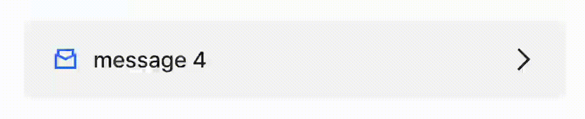
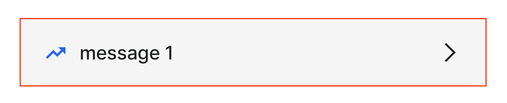
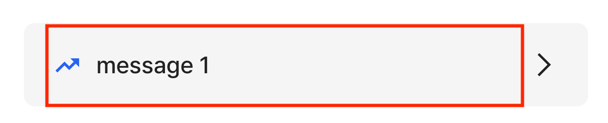

### ViewFlipper
특정 영역 내의 뷰가 일정 시간 간격으로 로테이션 되게끔 하려면 ViewFlipper 를 사용하여 편하게 구현할 수 있다.



1. `ViewFlipper` 가 적용될 영역을 아래와 같이 정의한다.
    

[view_flipper.xml]

```
<androidx.constraintlayout.widget.ConstraintLayout
    android:id="@+id/box_banner"
    android:layout_width="match_parent"
    android:layout_height="46dp"
    android:layout_marginTop="16dp"
    android:layout_marginBottom="24dp"
    android:layout_marginHorizontal="24dp"
    android:background="@drawable/bg_rect_grey_radius_6"
    >

    <ViewFlipper
        android:id="@+id/box_banner_contents_flipper"
        android:layout_width="0dp"
        android:layout_height="match_parent"
        app:layout_constraintTop_toTopOf="parent"
        app:layout_constraintBottom_toBottomOf="parent"
        app:layout_constraintStart_toStartOf="parent"
        app:layout_constraintEnd_toStartOf="@id/img_banner_navigation"
        />

    <ImageView
        android:id="@+id/img_banner_navigation"
        android:layout_width="wrap_content"
        android:layout_height="wrap_content"
        android:layout_marginEnd="16dp"
        app:srcCompat="@drawable/icon_arrows"
        app:layout_constraintTop_toTopOf="parent"
        app:layout_constraintBottom_toBottomOf="parent"
        app:layout_constraintEnd_toEndOf="parent"
        />
</androidx.constraintlayout.widget.ConstraintLayout>
```

2. `ViewFlipper` 에 추가될 'icon' 과 'message n' 이 포함된 커스텀 뷰 xml 을 정의한다.
   

[view_flipper_contents.xml]
```aidl
<?xml version="1.0" encoding="utf-8"?>
<androidx.constraintlayout.widget.ConstraintLayout xmlns:android="http://schemas.android.com/apk/res/android"
    xmlns:app="http://schemas.android.com/apk/res-auto"
    xmlns:tools="http://schemas.android.com/tools"
    android:layout_width="match_parent"
    android:layout_height="match_parent"
    >

    <ImageView
        android:id="@+id/img_icon"
        android:layout_width="wrap_content"
        android:layout_height="wrap_content"
        android:layout_marginStart="16dp"
        app:layout_constraintTop_toTopOf="parent"
        app:layout_constraintBottom_toBottomOf="parent"
        app:layout_constraintStart_toStartOf="parent"
        />

    <TextView
        android:id="@+id/txt_message"
        android:layout_width="0dp"
        android:layout_height="wrap_content"
        android:layout_marginHorizontal="8dp"
        android:text="message"
        app:layout_constraintTop_toTopOf="parent"
        app:layout_constraintBottom_toBottomOf="parent"
        app:layout_constraintStart_toEndOf="@id/img_icon"
        app:layout_constraintEnd_toEndOf="parent"
        />

</androidx.constraintlayout.widget.ConstraintLayout>


```


3. 위 xml 을 로드하는 커스텀 뷰를 정의한다
```aidl
class FlipperContentView @JvmOverloads constructor(
    context: Context,
    attributeSet: AttributeSet? = null,
    defStyle: Int = 0
) : ConstraintLayout(context, attributeSet, defStyle) {

    private val binding = ViewFlipperContentsBinding.inflate(
        LayoutInflater.from(context),
        this,
        true
    )

    var argument: Argument? = null
        set(value) {
            field = value
            value ?: return
            updateView(value)
        }

    private fun updateView(argument: Argument) {
        binding.imgIcon.setImageResource(argument.iconResId)
        binding.txtMessage.text = argument.message
    }
}

data class Argument(
    @DrawableRes val iconResId: Int,
    val message: String
)

```

4. `ViewFlipper` 가 정의된 뷰(Activity or Fragment) 에서 해당 ViewFlipper 에 접근해 view 를 add 하면 된다.

```aidl
val contents = listOf(
    Argument(
        R.drawable.icon_trendingup_s,
        resourceManager.getString(R.string.expert_profile_enhancement_inducement_banner_message1)
    ),
    Argument(
        R.drawable.icon_won_s,
        resourceManager.getString(R.string.expert_profile_enhancement_inducement_banner_message2)
    ),
    Argument(
        R.drawable.icon_proposal_s,
        resourceManager.getString(R.string.expert_profile_enhancement_inducement_banner_message3)
    ),
    Argument(
        R.drawable.icon_proposal_s,
        resourceManager.getString(R.string.expert_profile_enhancement_inducement_banner_message4)
    )
)


with(binding.boxBanner) {
    contents.forEach { content ->
        addView(FlipperContentView(context).apply { argument = content })
    }

    inAnimation = AnimationUtils.loadAnimation(
        context,
        R.anim.banner_contents_in_up    // flip 애니메이션
    ).apply {
        interpolator = AccelerateDecelerateInterpolator()
    }

    outAnimation = AnimationUtils.loadAnimation(
        context,
        R.anim.banner_contents_out_up   // flip 애니메이션
    ).apply {
        interpolator = AccelerateDecelerateInterpolator()   // 애니메이션 효과
    }

    this.flipInterval = flipInterval
    startFlipping()
}

```